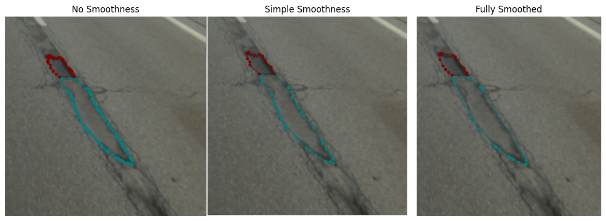

# `annotations_format_convertor_GUI Documentation:` 

---

## Overview:

The `annotations_format_convertor_GUI` is a user-friendly graphical interface designed to simplify the conversion of YOLO annotation formats between text and JSON representations. The tool accommodates both rectangular and segmentation annotation types.
## Installation

To start using the `annotations_format_convertor_GUI`, run the following commands:

1. **Clone the Repository Locally**:
   ```shell
    git clone https://github.com/Younis-Matouq/annotations_format_convertor_GUI.git
    ```

2. **Navigate to the Project Directory and Install the required Python packages using `pip`**:

    ```shell
    cd annotations_format_convertor_GUI
    ```

   ```shell
    pip install -r requirements.txt
    ```

## Functionalities:

1. **rect_convert_json_to_txt**: Convert rectangular annotations from JSON to text format.
2. **rect_convert_txt_to_json**: Convert rectangular annotations from text to JSON format.
3. **seg_convert_json_to_txt**: Convert segmentation annotations from JSON to text format.
4. **seg_convert_txt_to_json**: Convert segmentation annotations from text to JSON format.

**Note:** In the context of this tool:
- "rect" refers to **rectangular** annotations.
- "seg" refers to **segmentation** annotations.

## How to Use the Interface:

1. **Format Selection**:
    - From the "Choose Format to Convert to" dropdown menu, select the desired conversion format.

2. **Input Directory**:
    - Click on the "Input Directory" placeholder.
    - Browse and select the directory containing your annotation files.

3. **Output Directory**:
    - Click on the "Output Directory" placeholder.
    - Navigate and choose the directory where you wish the converted annotation files to be saved.

4. **Class Dictionary Selection**:
    - Click on the "Class Dict File Path" placeholder.
    - Browse and select a JSON file which enumerates all the classes contained in your annotations. Examples of the class dictionary can be found in both "class_dict_json_to_txt_example" and "class_dict_txt_to_json_example".

5. **Image Dimensions (For text to JSON only)**:
    - If you're converting from text to JSON, specify the image dimensions by entering the values for "Image Width" and "Image Height". These fields are essential as they represent the dimensions of the images corresponding to the annotations. Note: These input fields will be active only when you're converting from text to JSON format.

6. **Polygon Smoothness (For segmentation text to JSON only)**:
    - For conversions involving segmentation annotations from text to JSON, you have an added option to determine the smoothness level of polygons. Three options are available from a dropdown menu:
      - **No Smoothness**: Retains full detail of the polygon.
      - **Fully Smoothed**: Applies maximum smoothening, resulting in fewer polygonal details.
      - **Simple Smoothness**: A balanced option that moderately smoothens the polygon.
      
    - Check the output of each smoothness level: 
<p float="left" align="center">
  
</p>

7. **Execution**:
    - Once all the parameters are specified, simply click the "Run" button to initiate the conversion process.

